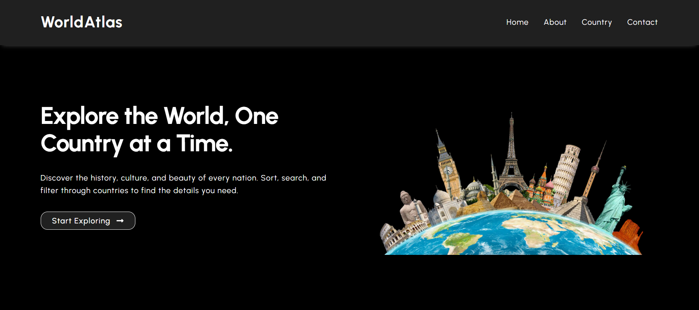
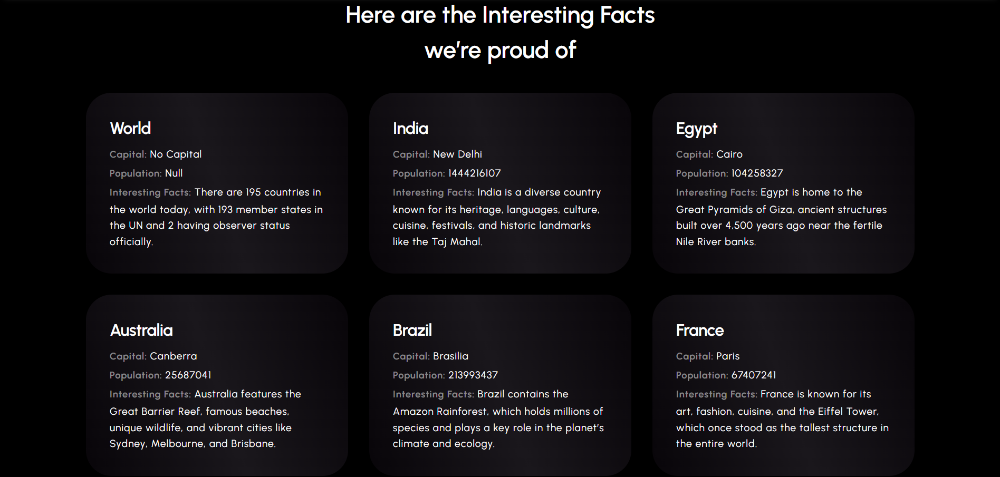
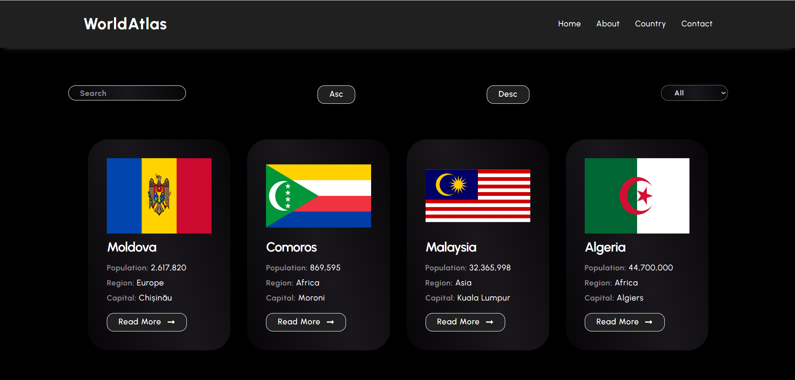

# 🌍 World Atlas Flags Explorer

A React-based web application that allows users to explore countries, view their flags, search, filter by region, and see country details — all with a clean, responsive UI.

**🔗 Live Demo:** [https://world-atlas-flag.netlify.app](https://world-atlas-flag.netlify.app)

---

## 📸 Screenshots

### 🏠 Home Page  


### ℹ️ About Page  


### 🌐 Country Detail Page  


---

## 🚀 Features

- 🌍 Country listing with flag, name, capital, region, and population
- 🔎 Real-time search by country name
- 🌐 Region-wise filter (Asia, Europe, Africa, etc.)
- 📃 Country detail page with additional info (language, subregion, domain, etc.)
- 📱 Responsive layout for all devices
- 🧭 Simple navigation using React Router

---

## 🧰 Tech Stack

- **React.js** – component-based UI
- **React Router DOM** – page navigation
- **Axios** – country data from [REST Countries API](https://restcountries.com/)
- **CSS** – plain CSS files for styling and responsiveness
- **Netlify** – deployed with CI/CD

---

## 📁 Project Structure
```
world-atlas/
├── public/
├── src/
│ ├── components/
│ ├── pages/
│ ├── App.jsx
│ └── index.js
├── Screenshots/
├── package.json
└── README.md

```


## 🛠️ Installation & Local Setup

Follow these steps to run the project locally on your machine:

```bash
# Clone the repository
git clone https://github.com/Hitesh-parmar-07/world-atlas.git

# Go to the project directory
cd world-atlas

# Install dependencies
npm install

# Start the development server
npm start 
```

Then open http://localhost:3000 in your browser to see the app running.

## ✍️ What I Learned

- Building SPAs with React + React Router
- Handling API data fetching and dynamic rendering
- Component-based architecture
- Managing app state with React Hooks
- Designing responsive layouts

## 🙌 Acknowledgements

- [REST Countries API](https://restcountries.com)
- [Netlify](https://netlify.com) – for deployment

👨‍💻 Created with ❤️ by Hitesh Parmar


